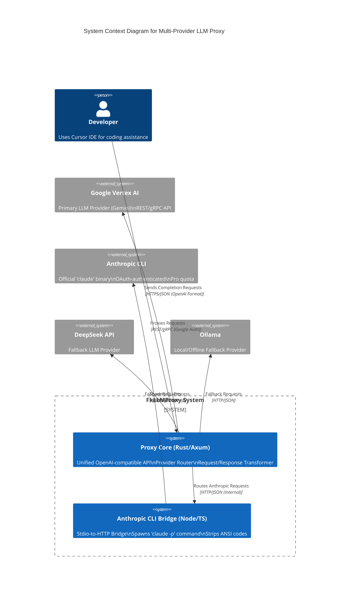
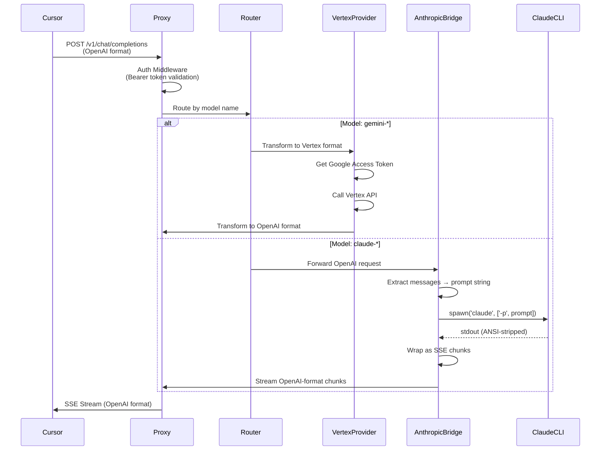

# System Design: Multi-Provider LLM Proxy

> **Manifesto**: A unified, high-performance bridge connecting OpenAI-compatible clients (Cursor) to multiple LLM providers via HTTP (Vertex AI) and stdio (Anthropic CLI).

## 1. High-Level Topology (C4 Context)



## 2. Data Flow & Architecture

### 2.1 Request Lifecycle (Unified)



### 2.2 Provider Routing Strategy

**Model Name → Provider Mapping**:

| Model Pattern | Provider | Transport |
|--------------|----------|-----------|
| `gemini-*` | Vertex AI | HTTP/REST |
| `claude-*` | Anthropic CLI | Stdio Bridge |
| `deepseek-*` | DeepSeek API | HTTP/REST |
| `ollama-*` | Ollama | HTTP/REST |

**Routing Logic** (via `ProviderRegistry::route_by_model()`):

```rust
// Provider routing uses ProviderRegistry which checks model prefixes:
let registry = ProviderRegistry::with_config(Some(bridge_url));
match registry.route_by_model(model) {
    Some(provider) => provider.execute(request, state).await,
    None => Err(ProviderError::InvalidRequest("Model not supported".into())),
}

// Supported prefixes:
// - "gemini-*" → Vertex AI
// - "claude-*" → Anthropic CLI (via bridge)
// - "deepseek-*" / "ollama-*" → Not yet implemented (enum defined, provider pending)
```

### 2.3 Anthropic CLI Bridge Pattern (Stdio-to-HTTP)

**Principle**: The Anthropic bridge runs as a separate Node.js service that:

1. Receives HTTP requests from the Rust proxy
2. Spawns `claude -p "prompt"` as a child process
3. Captures `stdout`, strips ANSI codes
4. Wraps output as OpenAI SSE chunks
5. Streams back to Rust proxy

**Data Flow**:

```text
[Rust Proxy] --HTTP--> [Anthropic Bridge (Node)] --spawn--> [claude CLI] --stdout--> [Bridge] --SSE--> [Rust Proxy]
```

**Advantages**:

- **0% Ban Risk**: Uses official Anthropic binary with OAuth
- **Pro Quota**: Direct access to user's Pro subscription
- **Maintenance-Free**: As long as `claude -p` works, bridge works

**Limitations**:

- **Context Window**: Full conversation history concatenated (token overhead)
- **Stateless**: CLI doesn't maintain conversation state
- **Latency**: Process spawn overhead (~10-50ms)

### 2.4 Latency Budget

| Component | P50 | P95 | Notes |
|-----------|-----|-----|-------|
| Proxy Overhead (Auth + Route) | < 10ms | < 20ms | Rust native |
| Vertex Transform | < 5ms | < 10ms | In-memory |
| Anthropic Bridge (HTTP) | < 5ms | < 10ms | Localhost |
| Anthropic CLI Spawn | 10-50ms | 50-100ms | Process creation |
| Vertex API Network | 50-200ms | 200-500ms | Region-dependent |
| Anthropic CLI Execution | 500-2000ms | 2000-5000ms | LLM generation |

**Total P50**: ~70ms (Vertex) / ~570ms (Anthropic CLI)

## 3. State Management Strategy

### 3.1 Single Source of Truth

**Server State (In-Memory, Rust Proxy)**:

- **Auth Tokens**: Google Cloud Access Tokens (cached, refreshed ~55 mins)
- **Rate Limiters**: Token buckets per IP/API key
- **Circuit Breaker Status**: Health state of providers
- **Provider Registry**: Active provider configurations

**Anthropic Bridge State (Node.js)**:

- **Process Pool**: Optional pool of pre-spawned `claude` processes (future optimization)
- **ANSI Stripper**: Shared `strip-ansi` instance

**Client State (Cursor)**:

- **Conversation History**: Managed by Cursor, sent in each request
- **Model Selection**: User-configured in Cursor settings

### 3.2 State Location Matrix

| Data | Location | Lifetime | Persistence |
|------|----------|----------|-------------|
| Google OAuth Token | Rust Proxy (Memory) | ~55 minutes | None (refreshed) |
| Rate Limit Counters | Rust Proxy (Memory) | Per request window | None |
| Circuit Breaker State | Rust Proxy (Memory) | Until reset | None |
| Conversation History | Cursor (Client) | Per session | User's Cursor state |
| Anthropic OAuth Token | CLI Binary (OS Keychain) | Until logout | OS keychain |
| Provider Config | Rust Proxy (Config File) | Until restart | TOML/Env |

**Rule**: If it can be derived, do not store it.

## 4. Technology Stack

### 4.1 Core Proxy (Rust)

| Component | Technology | Rationale |
|-----------|-----------|-----------|
| **Language** | Rust (2024 edition) | Zero-cost abstractions, memory safety |
| **Runtime** | Tokio | Async runtime, high concurrency |
| **Web Framework** | Axum 0.7 | Type-safe routing, middleware |
| **HTTP Client** | Reqwest (rustls) | Async HTTP, TLS without OpenSSL |
| **Serialization** | Serde (JSON) | Zero-copy deserialization |
| **Observability** | Tracing + OpenTelemetry | Structured logging, metrics |
| **Configuration** | config-rs (TOML) | Hierarchical config, env override |

### 4.2 Anthropic Bridge (Node.js/TypeScript)

| Component | Technology | Rationale |
|-----------|-----------|-----------|
| **Language** | TypeScript | Type safety, ecosystem |
| **Runtime** | Node.js | Process spawning, stdio handling |
| **Web Framework** | Express | Simple HTTP server |
| **ANSI Stripping** | strip-ansi | Clean CLI output |
| **Process Management** | child_process (spawn) | Native stdio capture |

### 4.3 Communication Protocol

- **Client ↔ Proxy**: HTTPS/JSON (OpenAI Chat Completions API)
- **Proxy ↔ Vertex**: REST/gRPC (Google Vertex AI API)
- **Proxy ↔ Anthropic Bridge**: HTTP/JSON (Internal, localhost)
- **Anthropic Bridge ↔ CLI**: Stdio (spawn process)

**Decision**: No gRPC between proxy and bridge (overkill for localhost). HTTP is sufficient.

## 5. API Interface (Contract)

### 5.1 Unified OpenAI-Compatible Interface

The proxy exposes a **strict subset** of OpenAI Chat Completions API:

**Request** (`POST /v1/chat/completions`):

```typescript
{
  model: string;              // "gemini-2.0-flash" | "claude-3-5-sonnet" | ...
  messages: ChatMessage[];    // Conversation history
  temperature?: number;       // 0.0 - 2.0
  max_tokens?: number;       // Max completion tokens
  stream?: boolean;          // SSE streaming
  stop?: string | string[];  // Stop sequences
  // ... other OpenAI params
}
```

**Response (Streaming)**:

```text
data: {"id": "...", "object": "chat.completion.chunk", "choices": [{"delta": {"content": "..."}}]}
data: {"id": "...", "object": "chat.completion.chunk", "choices": [{"delta": {"content": "..."}}]}
data: [DONE]
```

**Response (Non-Streaming)**:

```typescript
{
  id: string;
  object: "chat.completion";
  model: string;
  choices: ChatCompletionChoice[];
  usage?: { prompt_tokens, completion_tokens, total_tokens };
}
```

### 5.2 Provider-Specific Transformations

**Vertex AI**:

- `messages` → `contents[]` (role mapping: `assistant` → `model`)
- `system` messages → `system_instruction`
- `temperature`, `max_tokens` → `generationConfig`

**Anthropic CLI**:

- `messages[]` → Concatenated prompt string: `"role: content\n\nrole: content\n\nAssistant:"`
- No parameter translation (CLI `-p` mode is simple)
- Output → SSE chunks with `delta.content`

### 5.3 Internal Bridge API (Proxy ↔ Anthropic Bridge)

**Request** (`POST /anthropic/chat`):

```typescript
{
  messages: ChatMessage[];
  model: string;  // Passed through for identification
}
```

**Response**: SSE stream (same format as OpenAI)

## 6. Component Boundaries

### 6.1 Where Client Ends, Server Begins

- **Client (Cursor)**: Manages conversation history, UI state, model selection
- **Proxy**: Stateless request router, transformer, provider coordinator
- **Providers**: External services (Vertex, Anthropic CLI, etc.)

**No SSR/CSR distinction**: This is a pure API proxy. Cursor handles all UI.

### 6.2 Error Handling Strategy

| Error Type | Handler | Response |
|-----------|---------|----------|
| **Auth Failure** | Middleware | 401 Unauthorized |
| **Invalid Request** | Transformer | 400 Bad Request |
| **Provider Unavailable** | Circuit Breaker | 503 Service Unavailable |
| **Provider Error** | Provider Adapter | 502 Bad Gateway (with error body) |
| **Timeout** | Timeout Middleware | 504 Gateway Timeout |

**Error Format** (OpenAI-compatible):

```json
{
  "error": {
    "message": "Provider error: ...",
    "type": "invalid_request_error",
    "code": "provider_error"
  }
}
```

## 7. Deployment Architecture

### 7.1 Local Development

```text
┌─────────────────┐
│   Cursor IDE    │
└────────┬────────┘
         │ localhost:4000
         ▼
┌─────────────────┐
│  Rust Proxy     │
│  (cargo run)    │
└────────┬────────┘
         │
    ┌────┴────┐
    │         │
    ▼         ▼
┌────────┐ ┌──────────────┐
│ Vertex │ │ Anthropic    │
│   AI   │ │ Bridge (TS)  │
└────────┘ └──────┬───────┘
                  │ spawn
                  ▼
            ┌──────────┐
            │  claude  │
            │   CLI    │
            └──────────┘
```

### 7.2 Production (Future)

- **Rust Proxy**: Docker container, Kubernetes deployment
- **Anthropic Bridge**: Sidecar container (same pod) or separate service
- **Health Checks**: `/health` endpoint for both services
- **Observability**: OpenTelemetry → Prometheus/Grafana

## 8. Data Contract (Shared Types)

See `docs/api/api-contract.ts` for TypeScript definitions.

**Key Contracts**:

- `ChatCompletionRequest`: Input format (OpenAI-compatible)
- `ChatCompletionResponse`: Non-streaming output
- `ChatCompletionChunk`: Streaming output chunks
- Provider-specific types (internal): `VertexGenerateContentRequest`, etc.

**Rule**: Frontend and Backend must agree on these types. No "we'll figure it out later."

---

**Status**: ✅ **IMPLEMENTED** - Core (Vertex AI) implemented. Anthropic CLI bridge integrated via `bridge/` service.
