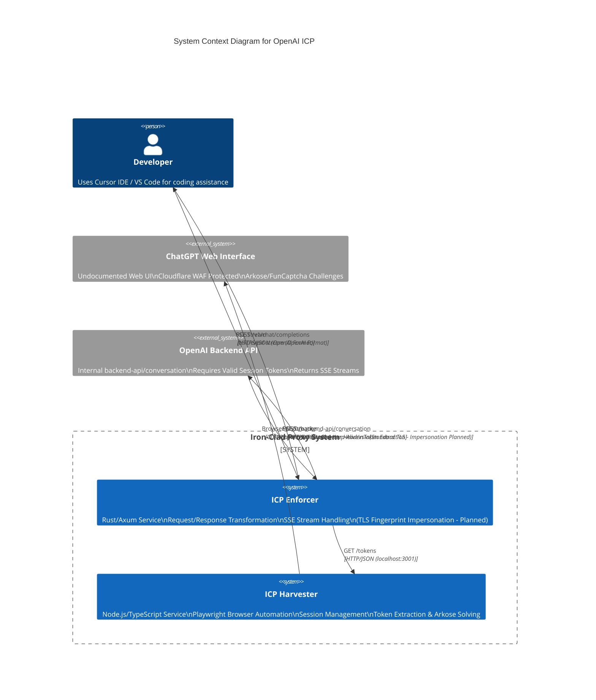

# System Design: Iron-Clad Proxy (ICP) - OpenAI Web Interface Bridge

> **Manifesto**: Split-process architecture bridging OpenAI-compatible clients to the ChatGPT Web Interface via TLS fingerprinting and browser automation.

## 1. High-Level Topology (C4 Context)



## 2. Data Flow & Architecture

### 2.1 Request Lifecycle (User Action → Database → Response)

**Latency Budget:**

- **Harvester Token Fetch**: 50-200ms (cached) or 2-5s (fresh Arkose solve)
- **Enforcer Transform**: < 10ms
- **TLS Handshake + Request**: 100-300ms
- **SSE Stream Start**: 200-500ms (first token)
- **Total First Token**: 350ms - 6s (worst case with Arkose)

**Flow:**

1. **Ingress**: Client sends `POST /v1/chat/completions` (OpenAI format).
2. **Auth Layer**: Validates `Authorization: Bearer <proxy-key>` (optional, for multi-tenant).
3. **Token Acquisition**: Enforcer queries Harvester `GET /tokens` (localhost:3001).
   - Harvester returns `{ access_token: string, arkose_token?: string }`
   - If `arkose_token` missing/expired, Harvester triggers browser automation.
4. **Request Transformation**:
   - OpenAI `messages[]` → Internal `node_id` structure
   - Map `model` to internal model identifier (e.g., `gpt-4` → `gpt-4`)
   - Preserve `temperature`, `max_tokens`, `stream`
5. **TLS Impersonation**:
   - `reqwest-impersonate` with Chrome v120+ ClientHello
   - Strict header ordering: `User-Agent`, `Accept-Language`, `Referer`
   - JA3/JA4 signature matching
6. **Upstream Request**:
   - `POST https://chatgpt.com/backend-api/conversation`
   - Headers: `Authorization: Bearer {access_token}`, `Openai-Sentinel-Arkose-Token: {arkose_token}`
7. **Response Parsing**:
   - Parse raw SSE from backend
   - Filter internal metadata (moderation flags, internal events)
   - Transform to OpenAI `ChatCompletionChunk` format
8. **Egress**: Stream SSE chunks back to client.

### 2.2 Component Boundaries

**The Enforcer (Rust):**

- **Boundary**: Stateless HTTP server (except in-memory token cache)
- **State Location**:
  - In-Memory: Token cache (TTL: 2 minutes for `arkose_token`, 1 hour for `access_token`)
  - No persistence required
- **Failure Mode**: If Harvester unavailable, return 503. If TLS fingerprint fails, log and retry with different profile.

**The Harvester (TypeScript):**

- **Boundary**: Long-lived browser process (Chromium via Playwright)
- **State Location**:
  - Browser Context: Session cookies, localStorage
  - In-Memory: Active browser instance, token cache
  - Optional Persistence: Cookie jar file (for session recovery)
- **Failure Mode**: If browser crashes, restart and re-authenticate. If Arkose fails, return error to Enforcer.

## 3. State Management Strategy

### 3.1 Single Source of Truth

**Server State (In-Memory):**

- **Enforcer**:
  - Token cache: `HashMap<String, TokenPair>` (key: session_id, value: `{ access_token, arkose_token, expires_at }`)
  - Rate limiters: Token buckets per IP/Key
- **Harvester**:
  - Active browser instance: Single Playwright `Browser` context
  - Token cache: Same structure as Enforcer (shared via HTTP API)
  - Session validity: Periodic health check (navigate to `/api/auth/session`)

**URL State:**

- None (stateless API)

**Client State:**

- None (proxy is transparent to client)

**Derived State:**

- `arkose_token` expiration derived from timestamp (2-minute TTL)
- Session validity derived from HTTP response codes

### 3.2 State Synchronization

**Enforcer ↔ Harvester:**

- **Protocol**: HTTP REST (localhost:3001)
- **Endpoints**:
  - `GET /tokens` → Returns cached tokens or triggers refresh
  - `POST /refresh` → Forces Arkose token regeneration
  - `GET /health` → Browser instance health check
- **Cache Invalidation**: Harvester notifies Enforcer on token refresh (via WebSocket or polling)

## 4. Technology Stack

### 4.1 The Enforcer (Rust)

- **Language**: Rust (2024 edition, `edition = "2021"`)
- **Runtime**: Tokio (async/await)
- **Web Framework**: Axum (HTTP server, SSE streaming)
- **HTTP Client**: `reqwest-impersonate` (CRITICAL: TLS fingerprint spoofing)
- **JSON**: `serde` + `serde_json` (high-performance serialization)
- **Observability**: `tracing` + `tracing-subscriber` (structured logging)
- **Configuration**: `config` crate (TOML/env vars)
- **Error Handling**: `anyhow` + `thiserror` (no `unwrap()`, use `?`)

**Dependencies:**

```toml
[dependencies]
axum = "0.7"
tokio = { version = "1", features = ["full"] }
reqwest-impersonate = "0.11"  # Fork with BoringSSL
serde = { version = "1", features = ["derive"] }
serde_json = "1"
tracing = "0.1"
tracing-subscriber = "0.3"
anyhow = "1"
thiserror = "1"
config = "0.14"
uuid = { version = "1", features = ["v4"] }
```

### 4.2 The Harvester (TypeScript)

- **Language**: TypeScript (Node.js 22+)
- **Runtime**: Node.js (ESM modules)
- **Browser Automation**: Playwright (Chromium)
- **HTTP Server**: Fastify (lightweight, fast)
- **Token Extraction**: CDP (Chrome DevTools Protocol) via Playwright
- **Observability**: `pino` (structured logging)

**Dependencies:**

```json
{
  "dependencies": {
    "playwright": "^1.40.0",
    "fastify": "^4.24.0",
    "pino": "^8.16.0",
    "pino-pretty": "^10.2.0"
  },
  "devDependencies": {
    "@types/node": "^20.10.0",
    "typescript": "^5.3.0",
    "tsx": "^4.7.0"
  }
}
```

### 4.3 Communication Protocol

- **Enforcer → Harvester**: HTTP REST (localhost:3001)
- **Harvester → ChatGPT Web**: CDP/Playwright (headless browser)
- **Enforcer → OpenAI Backend**: HTTPS with TLS impersonation
- **Client → Enforcer**: HTTPS (standard OpenAI API)

## 5. Data Contract (Schema First)

### 5.1 Client → Enforcer (OpenAI Standard)

See `api-contract.ts` for full specification. Key types:

```typescript
interface ChatCompletionRequest {
    model: string;  // e.g., "gpt-4", "gpt-3.5-turbo"
    messages: ChatMessage[];
    temperature?: number;
    max_tokens?: number;
    stream: boolean;  // Always true for SSE
}

interface ChatCompletionChunk {
    id: string;
    object: "chat.completion.chunk";
    created: number;
    model: string;
    choices: Array<{
        index: number;
        delta: { content?: string; role?: string };
        finish_reason: string | null;
    }>;
}
```

### 5.2 Enforcer → Harvester (Internal API)

```typescript
// GET /tokens
interface TokenResponse {
    access_token: string;
    arkose_token?: string;  // Optional, required for GPT-4
    expires_at: number;  // Unix timestamp
}

// POST /refresh
interface RefreshRequest {
    force_arkose?: boolean;  // Force Arkose token regeneration
}

// GET /health
interface HealthResponse {
    browser_alive: boolean;
    session_valid: boolean;
    last_token_refresh: number;
}
```

### 5.3 Enforcer → OpenAI Backend (Internal Format)

**Request:**

```json
{
  "action": "next",
  "messages": [
    {
      "id": "node_id_1",
      "role": "user",
      "content": { "content_type": "text", "parts": ["Hello"] }
    }
  ],
  "model": "gpt-4",
  "parent_message_id": "...",
  "conversation_id": "..."
}
```

**Response (SSE):**

```text
event: message
data: {"message": {"id": "...", "content": {"parts": ["Hi"]}}, "conversation_id": "..."}

event: done
data: [DONE]
```

### 5.4 Conflict Resolution

**Naming Conflicts:**

- OpenAI API uses `model` → Backend uses `model` (no conflict)
- OpenAI API uses `messages[]` → Backend uses `messages[]` with `node_id` structure (transformation required)
- OpenAI API uses `content: string` → Backend uses `content: { parts: string[] }` (transformation required)

**Resolution Strategy:**

- Transform at Enforcer boundary (Rust transformer module)
- Never expose internal format to client
- Log transformation errors for debugging

## 6. Implementation Constraints

### 6.1 Zero Tolerance Protocol

- **NO SUICIDE CODE**: Use `?` operator, `match`, `unwrap_or_default`. No `unwrap()` except tests.
- **NO LAZY FIXES**: Delete dead code. Fix types. Handle errors.
- **NO MYSTERY MEAT**: Use env vars for secrets, constants for magic numbers.

### 6.2 TLS Fingerprint Requirements (PLANNED - NOT YET IMPLEMENTED)

- **PLANNED**: Use `reqwest-impersonate` (not standard `reqwest`) - see TODO in `src/openai/backend.rs`
- **CURRENT STATE**: Using standard `reqwest` which may be blocked by WAF
- **Configuration**: Runtime configurable impersonation target (Chrome120, Edge119, etc.) - planned
- **Header Ordering**: Must match browser exactly (User-Agent, Accept-Language, Referer) - partially implemented

### 6.3 Browser Automation Requirements

- **Session Keep-Alive**: Navigate or interact every 5-10 minutes
- **Token Extraction**: Intercept `fetch` to `/api/auth/session`
- **Arkose Trigger**: Inject script to call `window.arkose` callback

## 7. Failure Modes & Mitigation

| Failure | Detection | Mitigation |
|---------|-----------|------------|
| WAF blocks TLS fingerprint | 403/429 from backend | Switch impersonation profile, retry |
| Arkose token expired | 401 from backend | Trigger Harvester refresh |
| Browser crashes | Health check fails | Restart browser, re-authenticate |
| Session invalid | 401 from backend | Harvester re-login |
| Harvester unavailable | Connection refused | Return 503 to client, log error |

## 8. Observability

- **Metrics**: Request latency, token cache hit rate, Arkose solve time, WAF block rate
- **Logging**: Structured JSON logs (tracing in Rust, pino in TypeScript)
- **Tracing**: OpenTelemetry spans for request lifecycle
- **Alerts**: Harvester health check failures, WAF block rate > 10%
