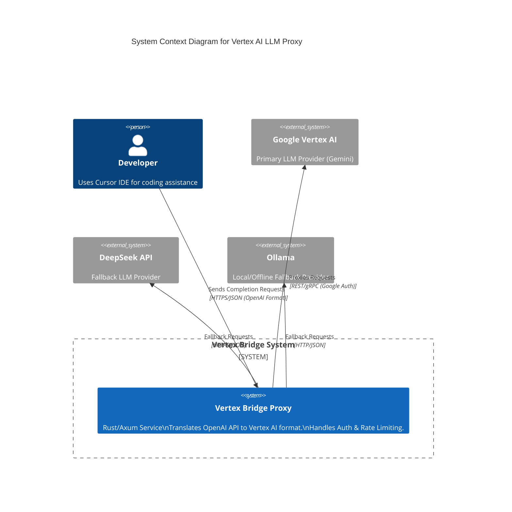

# System Design: Vertex AI LLM Proxy

> **Manifesto**: A high-performance, Rust-native bridge connecting OpenAI-compatible clients (Cursor) to Google's Vertex AI.

## 1. High-Level Topology (C4 Context)

This diagram illustrates the system context, showing how the Vertex Bridge interacts with users and external AI providers.

## 2. Data Flow & Architecture

### Request Lifecycle

1. **Ingress**: Client (Cursor) sends `POST /v1/chat/completions` (OpenAI format).
2. **Auth Layer**: Validates `Authorization: Bearer <proxy-key>`.
3. **Router**: Determines provider based on model name (e.g., `gemini-2.5-flash` -> Vertex).
4. **Transformation**: Converts OpenAI JSON body to Vertex `generateContent` payload.
5. **Execution**:
    * Acquires valid Google Access Token (cached/refreshed).
    * Sends request to Vertex AI.
6. **Response Handling**:
    * Receives Vertex response (stream or unary).
    * Transforms back to OpenAI `ChatCompletionChunk` or `ChatCompletion`.
7. **Egress**: Streams response back to Client.

### Latency Budget

* **Proxy Overhead**: < 50ms (Auth + Transform + Routing).
* **Network**: Dependent on region (Tokyo/US-Central).

## 3. State Management Strategy

* **Stateless Core**: The proxy itself handles requests statelessly.
* **Server State (In-Memory)**:
  * **Auth Tokens**: Google Cloud Access Tokens (cached, refreshed every ~55 mins).
  * **Rate Limiters**: Token buckets per IP/Key.
  * **Circuit Breaker Status**: Health state of providers.
* **Persistence**: None required for V1. Logs/Metrics sent to stdout/OTel.

## 4. Technology Stack

* **Language**: Rust (2024 edition)
* **Runtime**: Tokio
* **Web Framework**: Axum
* **HTTP Client**: Reqwest
* **Observability**: Tracing + OpenTelemetry
* **Configuration**: TOML (config crate)

## 5. API Interface (Contract)

The system adheres strictly to the OpenAI Chat Completions API.
See `api-contract.ts` for the TypeScript definition of the supported subset.
